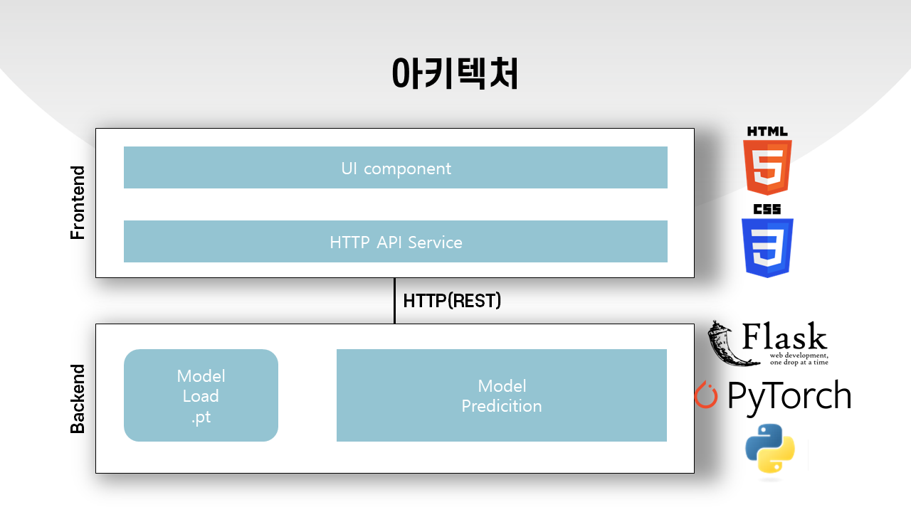
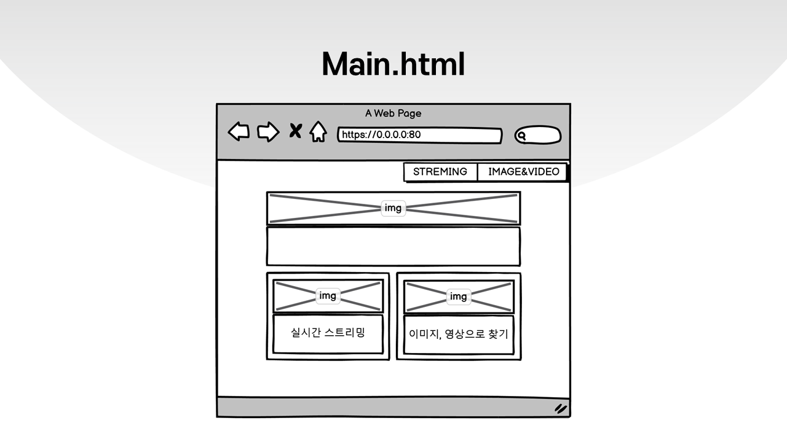
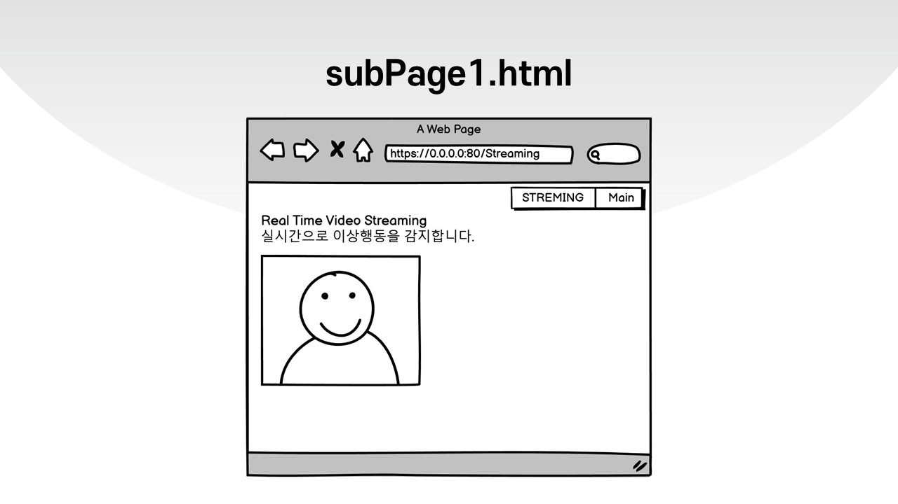
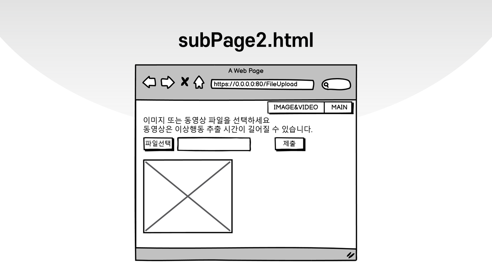

# Using CCTV image sample data, make abnormal behavior detection model
## CCTV 이미지 샘플데이터를 이용한 이상행동 탐지 모델 제작
### 개요
먼저 프로젝트 주제선정 배경 및 개요입니다. 나라지표의 사이트 정보에 따르면 국내 공공기관 CCTV 설치 및 증가대수는 해가 갈수록 점점 증가하는 추세이며, 범죄가 발생하면 CCTV를 확보하는 것이 우선이 될 정도로 강력사건의 결정적인 역할을 하면서 해결사로 떠오르고 있습니다. 한편으로는 CCTV가 사후 범인 검거 능력은 탁월하지만 범죄 예방 효과는 크지 않다는 우려가 있습니다. 또한 범죄 예방을 위해 지속적으로 입력되는 영상을 사람이 직접 감시하고 비정상 행위를 검출하는 일은 한계가 있습니다. 따라서 범죄 예방 및 운영 효율성을 증대시키기 위해서는 자동으로 비정상적인 이벤트를 검출하고 추적하기 위한 영상 분석 기술이 필요하다고 생각하여 프로젝트 주제를 이와 같이 정하였습니다.
### 프로젝트 내용
- 데이터 준비
- 데이터 전처리
- 모델 학습
- 모델 테스트
- 웹 페이지 & 서버 개발

### 일정

### 요구사항

### 아키텍처

### 설계
#### UI 설계서

### 테스트
